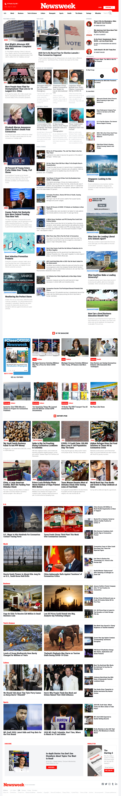

# Newsweek Clone using Bootstrap

> This project is a replica of the Newsweek website using Bootstrap.

- SASS for customizations.
-cBootstrap & customizations compiled in 1 single CSS file to reduce HTTP requests.

[Original](https://www.newsweek.com/)

## Built With

- HTML5
- SASS
- Bootstrap

## Live Demo

[Live Demo](https://marcoshdezcam.github.io/gh-pages-lives/P7_Newsweek_Bootstrap)

## Author

👤 **Marcos Hernández Campos**

- Github: [@marcoshdezcam](https://github.com/marcoshdezcam)
- Twitter: [@MarcosHCampos](https://twitter.com/MarcosHCampos)
- Linkedin: [Marcos Hernández](https://linkedin.com/marcos-hernández-56058119a/)

## 🤝 Contributing

Contributions, issues and feature requests are welcome!

Feel free to check the [issues page](issues/).

## Show your support

Give a ⭐️ if you like this project!
